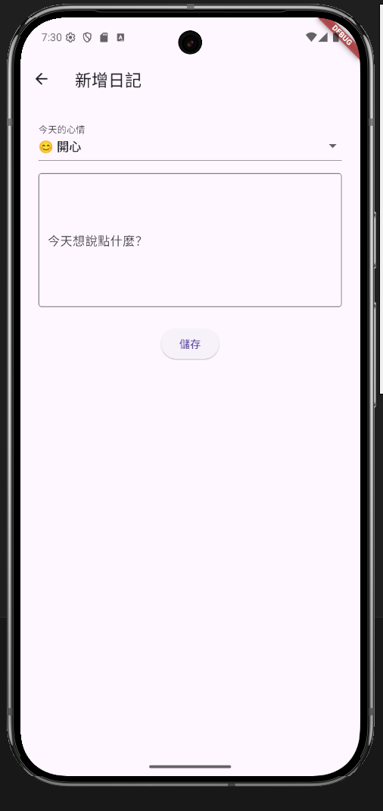
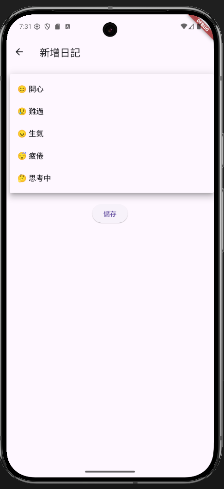
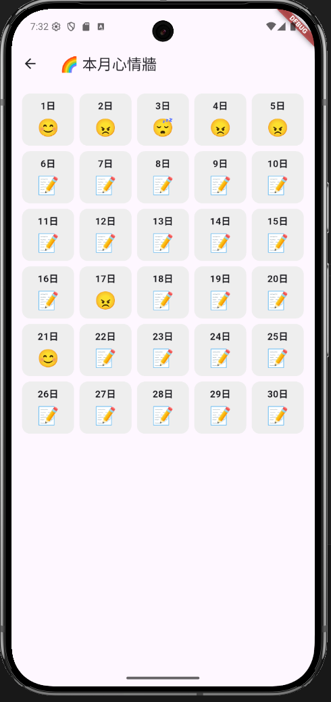
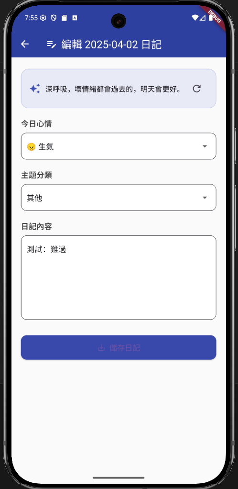

# 🌈 Flutter Mood Journal App

一款使用 Flutter + Firebase 製作的「迷你心情日記打卡簿」，支援使用者每日記錄情緒、文字內容，並自動生成 AI 鼓勵語，幫助用戶了解自我、持續陪伴。


---

## 🖼️ 預覽畫面

| 主畫面 | 新增日記 | 心情選擇 | 心情統計 | AI 鼓勵語 |
|---------|---------|---------|------------|
|  | |  |  |  |

---

## ✨ 核心功能

- 🧠 **心情選擇**：選擇每天的心情 Emoji，例如「😄 開心」、「😠 生氣」、「🥱 疲倦」…
- 📓 **日記記錄**：輸入當天的情緒描述與簡短感受
- 📅 **心情月曆**：以 GridView 呈現本月每日心情，回顧情緒起伏
- 🔄 **日記編輯與刪除**：支援日記編輯、即時儲存與刪除
- ☀️ **AI 鼓勵語（Gemini）**：整合 Google Gemini API，自動生成每日一句暖心話

---

## 🤖 AI 功能介紹（Gemini Pro）

每篇日記儲存時，會依據使用者當天選擇的心情，自動向 Gemini API 請求生成「一句鼓勵語」，例如：

- 「今天也會是很好的一天，加油！」
- 「你值得被理解，願你感受到溫柔。」

🔄 用戶也可以點選重新整理按鈕，獲得另一句不同 AI 話語 🌟

> 本功能使用 [google_generative_ai](https://pub.dev/packages/google_generative_ai) 套件串接 Gemini Pro API。

---

## 🔧 技術架構

| 分類 | 使用技術 |
|------|------------|
| 前端框架 | Flutter 3.x |
| 資料儲存 | Firebase Firestore |
| 登入驗證 | Firebase Auth（匿名登入）|
| AI API | Google Gemini Pro（v1）|
| 動畫 | Shimmer 套件展示載入效果 |

---

## 📁 專案目錄架構

```
lib/
├── main.dart                # App 入口點
├── login_page.dart          # 匿名登入
├── journal_home_page.dart   # 日記首頁（卡片列表）
├── add_journal_page.dart    # 新增日記
├── edit_journal_page.dart   # 編輯 + AI 鼓勵語
├── mood_timeline_page.dart  # 心情時間軸（月曆顯示）
```

---

## 🚀 執行教學

```bash
flutter pub get
flutter run
```

> 📍 請先將 `google-services.json` 放入 `android/app/` 目錄中。

---

## 🧪 測試建議場景

- 連續新增 7 天心情，觀察情緒圖示演變
- 嘗試切換心情，查看 AI 鼓勵語是否會變化
- 離線時是否正確顯示錯誤提示 / 儲存暫存

---

## 🙌 開發者資訊

製作：[@zse25414](https://github.com/zse25414)  
作品名稱：Flutter Mood Journal  
使用者身份：一人開發、使用 Flutter + Firebase 架構

---

## 🛡️ 注意事項

- 請勿將 `google-services.json` 上傳 GitHub（已加入 `.gitignore`）
- 若需部署 Web 請使用 `flutter build web`
- Gemini API 金鑰需使用者自行申請

---

## 📎 參考資源

- [Flutter 官方教學](https://docs.flutter.dev)
- [Firebase for Flutter](https://firebase.flutter.dev)
- [Gemini API Docs](https://ai.google.dev)
- [Shimmer 套件](https://pub.dev/packages/shimmer)

---

> 若你喜歡這個專案，歡迎 Star ⭐ 支持！

